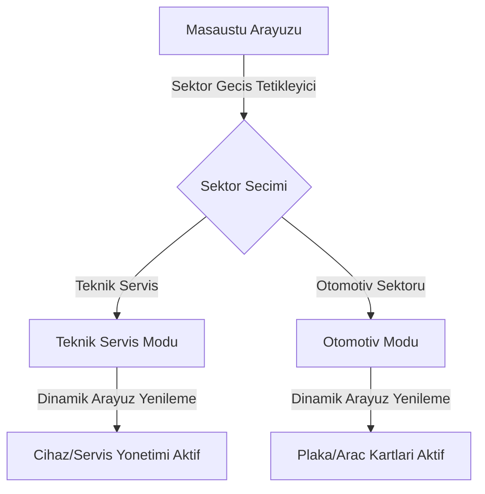
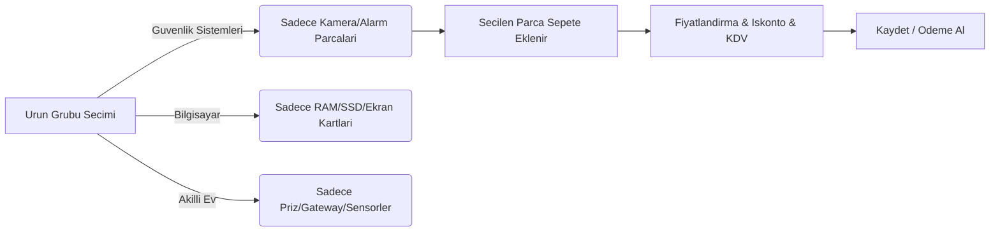

# 📚 AYEC Pro - Guncel Kullanici Kilavuzu

Bu kilavuz, AYEC Pro Servis ve Isletme Yonetim Sisteminin en guncel ozelliklerini ve menulerinin kullanimini ayrintili sekilde aciklamaktadir.

---

## 📋 ICINDEKILER
1. [Sistem Girisi ve Arayuz](#1-sistem-girisi-ve-arayuz)
2. [Sektor Gecisleri (Teknik Servis <-> Otomotiv)](#2-sektor-gecisleri-teknik-servis---otomotiv)
3. [Musteri Yonetimi (Musteri Hub)](#3-musteri-yonetimi-musteri-hub)
4. [Servis Yonetimi (Cihaz/Servis Kartlari)](#4-servis-yonetimi-cihazservis-kartlari)
5. [Sales Hub (Satis ve Hizmet Islemleri)](#5-sales-hub-satis-ve-hizmet-islemleri)
6. [Stok ve Yedek Parca Yonetimi](#6-stok-ve-yedek-parca-yonetimi)
7. [Finans ve Kasa/Banka Muhasebesi](#7-finans-ve-kasa-banka-muhasebesi)
8. [Jarvis AI Yoneticisi ve Sesli Asistan](#8-jarvis-ai-yoneticisi-ve-sesli-asistan)
9. [Yedekleme, Geri Yukleme ve Silinmis Kayitlar](#9-yedekleme-geri-yukleme-ve-silinmis-kayitlar)

---

## 1. Sistem Girisi ve Arayuz

Uygulama ilk acildiginda modern giris ekrani ile karsilasirsiniz.
- **Varsayilan Giris Bilgileri:**
  - **Kullanici Adi:** `admin`
  - **Sifre:** `admin123` (veya `admin` - kuruluma gore degisebilir)

### Genel Arayuz Yapisi
Arayuz; sol navigasyon menusu, ust durum barı ve orta icerik alanindan olusur.
Ust durum barinda aktif kullanici ismi, arayuz duzenleme araci ve sektor durum bilgisi yer alir.

---

## 2. Sektor Gecisleri (Teknik Servis <-> Otomotiv)

AYEC Pro, farkli sektorlerin ihtiyaclarina gore dinamik olarak sekillenebilen bir mimariye sahiptir. Sol alt panelde yer alan **Sektor Degistir** dugmesiyle modlar arasinda gecis yapabilirsiniz.

- **Teknik Servis Modu:** Cihaz markasi, modeli, seri numarasi, ariza kategorisi ve teknisyen atamasi gibi alanlari aktiflestirir.
- **Otomotiv Modu:** Plaka, sasi numarasi (VIN), kilometre, hasar isaretleme ve periyodik bakim paketleri gibi oto-servis odakli alanlari yukler.
- Sektor gecislerinde veritabaninda herhangi bir veri kaybi yasanmaz; arayuz formlari ve tablolar dinamik olarak yeniden yapilandirilir.

---

## 3. Musteri Yonetimi (Musteri Hub)

Musteri Hub, isletmenizin cari kayitlarini tuttugunuz merkezdir.

### Yeni Musteri Ekleme
1. Sol menuden **Musteri Hub** secenegine tiklayin.
2. **Yeni Musteri Ekle** butonuna basin.
3. Acilan formda; Ad/Soyad veya Firma Adi, Telefon, E-posta, Adres, TC Kimlik veya Vergi No alanlarini doldurun.
4. Kaydet butonuna basarak musterinizi kaydedin.

### Musteri Detay ve Cari Takip (Musteri 360)
- Musteri tablosundaki bir kayda cift tiklayarak musteri detay ekranini acabilirsiniz.
- **Islemler:**
  - **Servis Gecmisi:** Musterinin gecmiste getirdigi tum cihazlari ve durumlarini listeler.
  - **Borc/Alacak Takibi:** Musterinin toplam bakiyesini ve para birimi bazli (TRY, USD, EUR) borc detaylarini gosterir.
  - **Tahsilat Al:** Musteriden nakit, havale veya kredi karti ile para birimi bazli odeme alarak borcundan dusulmesini saglar.

---

## 4. Servis Yonetimi (Cihaz/Servis Kartlari)

Gelen ariza veya servis taleplerini kaydettiginiz alandir.

### Servis Kaydi Olusturma
1. **Servis Yonetimi** sayfasina gidin.
2. **Yeni Servis Kaydi** butonuna tiklayin.
3. Musteri arama bolumunden ilgili musteriyi secin (veya yeni musteri ekleyin).
4. Cihaz bilgilerini (Marka, Model, Seri No, Aksesuarlar) doldurun.
5. Ariza aciklamasini ve tahmini teslim tarihi ile maliyetini girip kaydedin.

### Servis Durum Guncelleme
Servisler asagidaki yasam dongusunu takip eder:
`Beklemede` -> `Islemde` -> `Hazir` -> `Teslim Edildi` (veya `Iptal`)

- Servis durumunu guncellemek icin servis kartinin sagindaki acilir menuden yeni durumu secmeniz yeterlidir.
- Durum degistiginde, eger aktif edilmisse, musteriye otomatik SMS veya WhatsApp/E-posta bildirimi gonderilir.

---

## 5. Sales Hub (Satis ve Hizmet Islemleri)

Sales Hub, hizli parca satisi, servis yedek parca ekleme ve musteri cari islemlerini tek ekrandan yonetmenizi saglar.

### Urun Grubuna Gore Filtreleme (Guncellendi)
- **Urun Grubu** secim alanindan bir kategori sectiginizde (ornegin *Guvenlik Sistemleri*, *Bilgisayar* veya *Akilli Ev*), alt taraftaki **Parca (Urunler)** listesi otomatik olarak filtrelenir.
- Boylece parcalarin karisik listelenmesi onlenmis olur ve sadece sectiginiz gruba ait parcalar (kamera, dedektor vb.) gelir.

---

## 6. Stok ve Yedek Parca Yonetimi

Isletmenizde kullandiginiz veya sattiginiz urunlerin takibini saglar.

### Stok Karti Olusturma
1. **Stok Yonetimi** ekranina gelin.
2. **Yeni Stok Karti** butonuna basarak urunun adini, kategorisini, barkodunu, satis fiyatini ve kritik stok limitini girin.

### Stok Hareketleri (Guncellendi)
- **Giris Islemleri:** Yeni urun eklendiginde veya alim yapildiginda otomatik olarak "Giris" hareketi olarak kaydedilir.
- **Cikis Islemleri (Guncellendi):** Servis esnasinda bir musteri cihazina parca takildiginda veya satis yapildiginda, veritabani otomatik olarak stoktan dusum yapar ve stok hareketlerine aciklamasiyla birlikte **"Cikis"** kaydini ekler.
- Stok hareket gecmisini **Stok Hareketleri** sekmesinden kronolojik olarak izleyebilirsiniz.

---

## 7. Finans ve Kasa/Banka Muhasebesi

Isletmenizin nakit akisini, gelir-gider dengesini ve banka hesaplarini yonetir.

### Gelir ve Gider Ekleme
- **Gelirler:** Tamamlanan servis tahsilatlari ve parca satislari finans modulu uzerinde otomatik gelir kaydi olusturur.
- **Giderler:** Kira, maas, fatura ve stok alimlari gibi harcamalar gider olarak kaydedilir.

### Banka Hesaplari Entegrasyonu
- Isletmeye ait banka hesaplarini tanımlayabilir, mevcut bakiyeleri gorebilir ve bankalar arasi transfer yapabilirsiniz.
- Gelir veya gider eklerken secilen banka hesabi uzerinden bakiyeler otomatik guncellenir.

---

## 8. Jarvis AI Yoneticisi ve Sesli Asistan

Jarvis, Google Gemini tabanli yapay zeka asistaninizdir.

### Kurulum
- **Ayarlar -> Gemini Ayarlari** sayfasina gidin.
- Google MakerSuite uzerinden aldiginiz API Key degerini ilgili alana girip kaydedin.

### Kullanim Sekilleri
1. **Veri Analizi:** Jarvis sohbet penceresinden *"Bu ayki net karimiz ne kadar?"*, *"Hangi parcalarin stogu azaldi?"* gibi sorular sorarak veritabani raporlarini analiz ettirebilirsiniz.
2. **Sesli Asistan:** Mikrofon ikonuna tiklayarak sesli komut modunu acabilir, konusarak islemleri yaptirabilir veya finansal ozeti sesli olarak dinleyebilirsiniz.

---

## 9. Yedekleme, Geri Yukleme ve Silinmis Kayitlar

Verilerinizin guvenligi icin gelismis yedekleme ekranlari sunulmustur.

### Otomatik ve Manuel Yedekleme
- **Yerel Yedekleme:** Her gun otomatik olarak yedek alinir. **Yedekleme** sayfasindan tek tikla manuel yedek de olusturabilirsiniz.
- **Bulut Yedekleme:** Veritabani yedeğinizi sunucuya şifreli (AES-256) olarak yukleyebilirsiniz.

### Geri Yukleme ve Silinmis Kayitlar (Soft Delete)
- Uygulamada silinen musteriler, servisler veya stok kartlari veritabanindan kalici olarak silinmez; **Soft Delete** yontemiyle silindi olarak isaretlenir.
- **Sistem Yardimcilari -> Silinmis Kayitlar** panelinden silinen verileri listeleyebilir ve tek tikla verileriniz bozulmadan geri yukleyebilirsiniz.

---
*Herhangi bir sorun yasarsaniz destek@ayecpro.com adresinden veya sistem icindeki Jarvis AI asistanindan yardim alabilirsiniz.*
