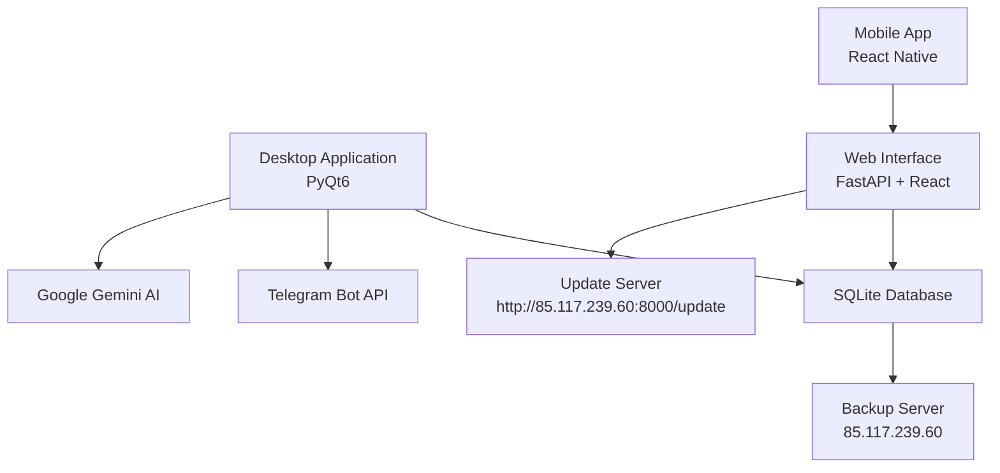
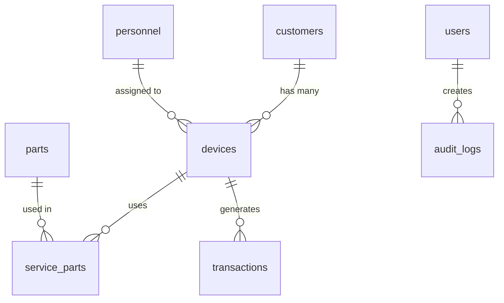

# AYEC Pro - Technical Documentation

**Version:** 3.2.0  
**Last Updated:** January 31, 2026  
**Target Audience:** Developers, System Administrators, Technical Support

---

## Table of Contents

1. [System Architecture](#1-system-architecture)
2. [Database Schema](#2-database-schema)
3. [API Documentation](#3-api-documentation)
4. [Desktop Application](#4-desktop-application)
5. [Web Interface](#5-web-interface)
6. [Mobile Application](#6-mobile-application)
7. [Integration Points](#7-integration-points)
8. [Security](#8-security)
9. [Deployment](#9-deployment)
10. [Troubleshooting](#10-troubleshooting)

---

## 1. SYSTEM ARCHITECTURE

### Overview

AYEC Pro is a multi-tier application consisting of three main components:



### Component Details

#### Desktop Application
- **Framework:** PyQt6
- **Language:** Python 3.10+
- **Entry Point:** `ModernDesktopApp.py`
- **Database:** SQLite (local file)
- **Location:** `%LOCALAPPDATA%\AYECPro\bulut_tech.db`

#### Web Server
- **Framework:** FastAPI (Python)
- **Entry Point:** `server_main.py`
- **Port:** 8000 (default)
- **Static Files:** `web_interface/static/`
- **API Prefix:** `/api/v1/`

#### Mobile Application
- **Framework:** React Native
- **Platform:** Android (iOS in development)
- **API Communication:** REST API via web server
- **Location:** `mobile-app/`

### Technology Stack

**Backend:**
- Python 3.10+
- SQLite 3
- FastAPI
- Uvicorn (ASGI server)
- PyInstaller (for .exe compilation)

**Frontend (Web):**
- React.js
- TailwindCSS
- Axios (HTTP client)
- Chart.js (for graphs)

**Frontend (Desktop):**
- PyQt6
- Custom UI components
- Qt Designer for layouts

**Frontend (Mobile):**
- React Native
- React Navigation
- AsyncStorage

**External Services:**
- Google Gemini AI API
- Telegram Bot API
- SMTP servers (for email)
- SMS providers (NetGSM, etc.)

---

## 2. DATABASE SCHEMA

### Core Tables

#### customers
```sql
CREATE TABLE customers (
    id INTEGER PRIMARY KEY AUTOINCREMENT,
    name TEXT NOT NULL,
    phone TEXT,
    email TEXT,
    address TEXT,
    tax_id TEXT,
    customer_type TEXT DEFAULT 'Individual', -- Individual/Corporate
    customer_group TEXT DEFAULT 'Normal', -- VIP/Normal
    notes TEXT,
    created_at TIMESTAMP DEFAULT CURRENT_TIMESTAMP,
    updated_at TIMESTAMP DEFAULT CURRENT_TIMESTAMP
);
```

#### devices (services)
```sql
CREATE TABLE devices (
    id INTEGER PRIMARY KEY AUTOINCREMENT,
    customer_id INTEGER NOT NULL,
    device_type TEXT,
    brand TEXT,
    model TEXT,
    serial_number TEXT,
    password TEXT,
    accessories TEXT,
    problem_description TEXT,
    technician_notes TEXT,
    estimated_cost REAL,
    labor_cost REAL,
    parts_cost REAL,
    total_cost REAL,
    advance_payment REAL DEFAULT 0,
    status TEXT DEFAULT 'Beklemede', -- Beklemede/İşlemde/Hazır/Teslim Edildi
    created_at TIMESTAMP DEFAULT CURRENT_TIMESTAMP,
    updated_at TIMESTAMP DEFAULT CURRENT_TIMESTAMP,
    delivery_date TIMESTAMP,
    FOREIGN KEY (customer_id) REFERENCES customers(id)
);
```

#### parts (inventory)
```sql
CREATE TABLE parts (
    id INTEGER PRIMARY KEY AUTOINCREMENT,
    name TEXT NOT NULL,
    category TEXT,
    stock_code TEXT UNIQUE,
    unit TEXT DEFAULT 'Adet',
    purchase_price REAL,
    sale_price REAL,
    vat_rate REAL DEFAULT 20,
    stock INTEGER DEFAULT 0,
    min_stock INTEGER DEFAULT 0,
    max_stock INTEGER DEFAULT 0,
    shelf_location TEXT,
    created_at TIMESTAMP DEFAULT CURRENT_TIMESTAMP,
    updated_at TIMESTAMP DEFAULT CURRENT_TIMESTAMP
);
```

#### personnel
```sql
CREATE TABLE personnel (
    id INTEGER PRIMARY KEY AUTOINCREMENT,
    name TEXT NOT NULL,
    tc_no TEXT,
    phone TEXT,
    email TEXT,
    address TEXT,
    position TEXT,
    start_date DATE,
    salary REAL,
    telegram_username TEXT,
    latitude REAL,
    longitude REAL,
    last_location_update TIMESTAMP,
    status TEXT DEFAULT 'Bosta', -- Bosta/Gorevde
    created_at TIMESTAMP DEFAULT CURRENT_TIMESTAMP
);
```

#### transactions (financial)
```sql
CREATE TABLE transactions (
    id INTEGER PRIMARY KEY AUTOINCREMENT,
    type TEXT NOT NULL, -- Income/Expense
    category TEXT,
    amount REAL NOT NULL,
    description TEXT,
    payment_method TEXT, -- Cash/CreditCard/BankTransfer
    invoice_no TEXT,
    related_service_id INTEGER,
    created_at TIMESTAMP DEFAULT CURRENT_TIMESTAMP,
    FOREIGN KEY (related_service_id) REFERENCES devices(id)
);
```

#### users (authentication)
```sql
CREATE TABLE users (
    id INTEGER PRIMARY KEY AUTOINCREMENT,
    username TEXT UNIQUE NOT NULL,
    password_hash TEXT NOT NULL,
    email TEXT,
    full_name TEXT,
    role TEXT DEFAULT 'Teknisyen', -- Yönetici/Muhasebe/Teknisyen
    is_active BOOLEAN DEFAULT 1,
    last_login TIMESTAMP,
    created_at TIMESTAMP DEFAULT CURRENT_TIMESTAMP
);
```

#### audit_logs
```sql
CREATE TABLE audit_logs (
    id INTEGER PRIMARY KEY AUTOINCREMENT,
    user_id INTEGER,
    table_name TEXT,
    action TEXT, -- INSERT/UPDATE/DELETE/VIEW
    record_id INTEGER,
    details TEXT,
    ip_address TEXT,
    created_at TIMESTAMP DEFAULT CURRENT_TIMESTAMP,
    FOREIGN KEY (user_id) REFERENCES users(id)
);
```

### Relationships



---

## 3. API DOCUMENTATION

### Base URL
```
http://localhost:8000/api/v1
```

### Authentication

**Login**
```http
POST /auth/login
Content-Type: application/json

{
  "username": "admin",
  "password": "admin123"
}

Response:
{
  "access_token": "eyJ0eXAiOiJKV1QiLCJhbGc...",
  "token_type": "bearer",
  "user": {
    "id": 1,
    "username": "admin",
    "role": "Yönetici"
  }
}
```

### Customers API

**List Customers**
```http
GET /customers?page=1&limit=50&search=ahmet
Authorization: Bearer {token}

Response:
{
  "total": 150,
  "page": 1,
  "limit": 50,
  "data": [
    {
      "id": 1,
      "name": "Ahmet Yılmaz",
      "phone": "05321234567",
      "email": "ahmet@example.com",
      "customer_type": "Individual"
    }
  ]
}
```

**Create Customer**
```http
POST /customers
Authorization: Bearer {token}
Content-Type: application/json

{
  "name": "Mehmet Demir",
  "phone": "05339876543",
  "email": "mehmet@example.com",
  "address": "İstanbul",
  "customer_type": "Individual"
}

Response:
{
  "id": 151,
  "name": "Mehmet Demir",
  "created_at": "2026-01-31T12:00:00"
}
```

**Update Customer**
```http
PUT /customers/{id}
Authorization: Bearer {token}
Content-Type: application/json

{
  "phone": "05441234567",
  "email": "newemail@example.com"
}
```

**Delete Customer**
```http
DELETE /customers/{id}
Authorization: Bearer {token}
```

### Services API

**List Services**
```http
GET /services?status=Beklemede&customer_id=1
Authorization: Bearer {token}

Response:
{
  "total": 25,
  "data": [
    {
      "id": 100,
      "customer_id": 1,
      "customer_name": "Ahmet Yılmaz",
      "device_type": "Telefon",
      "brand": "Samsung",
      "model": "Galaxy S21",
      "status": "Beklemede",
      "created_at": "2026-01-30T10:00:00"
    }
  ]
}
```

**Create Service**
```http
POST /services
Authorization: Bearer {token}
Content-Type: application/json

{
  "customer_id": 1,
  "device_type": "Telefon",
  "brand": "iPhone",
  "model": "13 Pro",
  "serial_number": "ABC123456",
  "problem_description": "Ekran kırık",
  "estimated_cost": 1500
}
```

**Update Service Status**
```http
PATCH /services/{id}/status
Authorization: Bearer {token}
Content-Type: application/json

{
  "status": "Hazır",
  "notes": "Ekran değiştirildi"
}
```

### Inventory API

**List Parts**
```http
GET /parts?category=Ekran&low_stock=true
Authorization: Bearer {token}
```

**Update Stock**
```http
POST /parts/{id}/stock
Authorization: Bearer {token}
Content-Type: application/json

{
  "quantity": 10,
  "type": "in", // in/out
  "notes": "Tedarikçiden alındı"
}
```

### Reports API

**Financial Summary**
```http
GET /reports/financial?start_date=2026-01-01&end_date=2026-01-31
Authorization: Bearer {token}

Response:
{
  "total_income": 45000,
  "total_expense": 25000,
  "net_profit": 20000,
  "income_by_category": {
    "Servis": 35000,
    "Parça Satışı": 10000
  },
  "expense_by_category": {
    "Kira": 10000,
    "Maaşlar": 15000
  }
}
```

---

## 4. DESKTOP APPLICATION

### Architecture

```
ModernDesktopApp.py (Main Entry)
├── src/
│   ├── ui/
│   │   ├── pages/          # Main application pages
│   │   ├── dialogs/        # Modal dialogs
│   │   └── widgets/        # Reusable UI components
│   ├── utils/
│   │   ├── database.py     # Database connection
│   │   ├── auth_manager.py # Authentication
│   │   ├── ai_service.py   # Gemini AI integration
│   │   └── startup_updater.py # Auto-update
│   └── db/
│       └── mixins/         # Database operations
└── assets/                 # Icons, images, fonts
```

### Key Components

#### Main Window (`ModernDesktopApp.py`)
- Navigation sidebar
- Page container (QStackedWidget)
- Status bar with notifications
- System tray integration

#### Database Layer (`src/utils/database.py`)
```python
class Database:
    def __init__(self, db_path):
        self.connection = sqlite3.connect(db_path)
        self.cursor = self.connection.cursor()
    
    def execute_query(self, query, params=None):
        # Execute with error handling
        pass
    
    def commit(self):
        self.connection.commit()
```

#### Authentication (`src/utils/auth_manager.py`)
```python
class AuthManager:
    def login(self, username, password):
        # Verify credentials
        # Generate session token
        # Return user object
        pass
    
    def check_permission(self, user, page):
        # Check if user has access to page
        pass
```

### Build Process

**PyInstaller Spec File:** `AYECPro_App.spec`

Key configurations:
- `console=False` - No console window
- `icon='assets\\app_icon.ico'` - Application icon
- `datas` - Include assets, src, web_interface
- `upx=True` - Compress executable

**Build Command:**
```bash
pyinstaller --clean AYECPro_App.spec
```

---

## 5. WEB INTERFACE

### Architecture

```
web_interface/
├── static/
│   ├── js/
│   │   ├── components/     # React components
│   │   ├── services/       # API services
│   │   └── utils/          # Utilities
│   ├── css/
│   │   └── styles.css      # TailwindCSS
│   └── index.html          # Main HTML
└── templates/              # Jinja2 templates (if any)
```

### React Components

**Customer List Component:**
```javascript
function CustomerList() {
  const [customers, setCustomers] = useState([]);
  
  useEffect(() => {
    fetchCustomers();
  }, []);
  
  const fetchCustomers = async () => {
    const response = await api.get('/customers');
    setCustomers(response.data);
  };
  
  return (
    <div className="customer-list">
      {customers.map(customer => (
        <CustomerCard key={customer.id} customer={customer} />
      ))}
    </div>
  );
}
```

### API Service Layer

```javascript
// services/api.js
import axios from 'axios';

const api = axios.create({
  baseURL: 'http://localhost:8000/api/v1',
  headers: {
    'Content-Type': 'application/json'
  }
});

// Add auth token to requests
api.interceptors.request.use(config => {
  const token = localStorage.getItem('token');
  if (token) {
    config.headers.Authorization = `Bearer ${token}`;
  }
  return config;
});

export default api;
```

---

## 6. MOBILE APPLICATION

### Architecture

```
mobile-app/
├── src/
│   ├── screens/            # App screens
│   ├── components/         # Reusable components
│   ├── navigation/         # Navigation config
│   ├── services/           # API services
│   └── utils/              # Utilities
├── android/                # Android native code
├── ios/                    # iOS native code (future)
└── App.js                  # Entry point
```

### Key Features

- Customer and service viewing
- Quick status updates
- Photo capture and upload
- Location sharing
- Push notifications

### API Integration

```javascript
// services/apiClient.js
import AsyncStorage from '@react-native-async-storage/async-storage';

const API_BASE = 'http://192.168.1.100:8000/api/v1';

export const apiClient = {
  async get(endpoint) {
    const token = await AsyncStorage.getItem('token');
    const response = await fetch(`${API_BASE}${endpoint}`, {
      headers: {
        'Authorization': `Bearer ${token}`
      }
    });
    return response.json();
  },
  
  async post(endpoint, data) {
    const token = await AsyncStorage.getItem('token');
    const response = await fetch(`${API_BASE}${endpoint}`, {
      method: 'POST',
      headers: {
        'Content-Type': 'application/json',
        'Authorization': `Bearer ${token}`
      },
      body: JSON.stringify(data)
    });
    return response.json();
  }
};
```

---

## 7. INTEGRATION POINTS

### Telegram Bot Integration

**Setup:**
1. Create bot via @BotFather
2. Get API token
3. Configure in app: Settings → Telegram Bot

**Location Tracking:**
```python
# src/bot/telegram_tracker.py
class TelegramTracker:
    def get_updates(self):
        url = f"{self.base_url}/getUpdates"
        response = requests.get(url, params={'offset': self.offset})
        return response.json().get('result', [])
    
    def update_personnel_location(self, username, lat, lng):
        # Update database with personnel location
        query = """
            UPDATE personnel 
            SET latitude = ?, longitude = ?, last_location_update = ?
            WHERE telegram_username = ?
        """
        self.db.execute_query(query, (lat, lng, datetime.now(), username))
```

### Google Gemini AI Integration

**Configuration:**
- API Key: Settings → Jarvis (Gemini) Settings
- Model: gemini-pro

**Usage:**
```python
# src/utils/ai_service.py
import google.generativeai as genai

class AIService:
    def __init__(self, api_key):
        genai.configure(api_key=api_key)
        self.model = genai.GenerativeModel('gemini-pro')
    
    def analyze_data(self, prompt, data):
        full_prompt = f"{prompt}\n\nData: {json.dumps(data)}"
        response = self.model.generate_content(full_prompt)
        return response.text
```

### Email Integration (SMTP)

```python
# src/utils/email_sender.py
import smtplib
from email.mime.text import MIMEText

class EmailSender:
    def send_email(self, to, subject, body):
        msg = MIMEText(body, 'html')
        msg['Subject'] = subject
        msg['From'] = self.smtp_user
        msg['To'] = to
        
        with smtplib.SMTP(self.smtp_server, self.smtp_port) as server:
            server.starttls()
            server.login(self.smtp_user, self.smtp_password)
            server.send_message(msg)
```

---

## 8. SECURITY

### Authentication

**Password Hashing:**
```python
import bcrypt

def hash_password(password):
    salt = bcrypt.gensalt()
    return bcrypt.hashpw(password.encode(), salt)

def verify_password(password, hashed):
    return bcrypt.checkpw(password.encode(), hashed)
```

**JWT Tokens:**
```python
from jose import jwt
from datetime import datetime, timedelta

SECRET_KEY = "your-secret-key-here"
ALGORITHM = "HS256"

def create_access_token(data: dict):
    to_encode = data.copy()
    expire = datetime.utcnow() + timedelta(hours=24)
    to_encode.update({"exp": expire})
    return jwt.encode(to_encode, SECRET_KEY, algorithm=ALGORITHM)
```

### Database Encryption

- SQLite database can be encrypted using SQLCipher
- Backup files encrypted with AES-256
- Network communication over TLS/SSL

### Access Control

**Role-Based Access Control (RBAC):**
```python
PERMISSIONS = {
    'Yönetici': ['*'],  # All permissions
    'Muhasebe': ['customers.view', 'services.view', 'finance.*', 'reports.*'],
    'Teknisyen': ['customers.view', 'services.*', 'parts.view', 'parts.use']
}

def has_permission(user_role, permission):
    role_perms = PERMISSIONS.get(user_role, [])
    if '*' in role_perms:
        return True
    return permission in role_perms or f"{permission.split('.')[0]}.*" in role_perms
```

---

## 9. DEPLOYMENT

### Desktop Application Deployment

**Build Process:**
1. Run `BuildSetup.ps1`
2. Generates `dist/AYECPro_App.exe`
3. Generates `dist/AYECPro_Server.exe`
4. Creates installer: `Setup_Output/AYECPro_Setup_v3.2.0.exe`

**Installation:**
- Target directory: `%LOCALAPPDATA%\AYECPro`
- Database: `%LOCALAPPDATA%\AYECPro\bulut_tech.db`
- Backups: `%LOCALAPPDATA%\AYECPro\backups`

**Desktop-Only Installer:**
- Script: `Setup_Files/AYECPro_Desktop_Setup.iss`
- Output: `dist/AYEC_Pro_Desktop_Setup_v{version}.exe`
- Default install path: `C:\Program Files\AYEC Pro`
- Desktop and Start Menu shortcuts are created
- Uninstall entry is registered automatically
- Build output uses onefile: `dist/AYECPro_App.exe`
- Installer copies PyQt6 DLLs into `{app}` so DLLs remain alongside the exe

**Firewall Configuration:**
```batch
REM ConfigureFirewall.cmd
netsh advfirewall firewall add rule name="AYEC Pro Server" dir=in action=allow protocol=TCP localport=8000
```

### Web Server Deployment

**Local Network:**
1. Start server from desktop app
2. Access via `http://{PC_IP}:8000`

**Remote Server:**
1. Deploy to VPS (e.g., 85.117.239.60)
2. Configure reverse proxy (nginx)
3. Enable HTTPS with SSL certificate
4. Set up systemd service for auto-start

**Nginx Configuration:**
```nginx
server {
    listen 80;
    server_name ayecpro.com;
    
    location / {
        proxy_pass http://localhost:8000;
        proxy_set_header Host $host;
        proxy_set_header X-Real-IP $remote_addr;
    }
}
```

### Mobile App Deployment

**Android:**
1. Build APK: `cd mobile-app && npx react-native build-android`
2. Sign APK with keystore
3. Distribute via web interface or Google Play

---

## 10. TROUBLESHOOTING

### Common Issues

**Issue: Database locked error**
```
Solution:
1. Close all instances of the application
2. Delete .db-shm and .db-wal files
3. Restart application
```

**Issue: Port 8000 already in use**
```
Solution:
1. Find process: netstat -ano | findstr :8000
2. Kill process: taskkill /PID {pid} /F
3. Or change port in Settings → Server Settings
```

**Issue: Turkish characters corrupted**
```
Solution:
1. Run kokten_cozum.py
2. Or execute: python -c "from src.utils.database import fix_encoding; fix_encoding()"
```

**Issue: Stock item added but list stays empty**
```
Root Cause:
- parts table schema missing columns (min_stock, purchase_price, category, code) so SELECT fails and UI falls back to empty state
Solution:
1. Ensure database schema migration runs (Database.update_parts_schema)
2. Verify parts table has required columns
3. Refresh stock list after adding items
```

**Issue: "Unknown property transform" warnings in logs**
```
Root Cause:
- Qt stylesheet engine does not support CSS transform
Solution:
1. Remove unsupported transform properties from QSS
2. Use supported Qt effects (e.g., QGraphicsDropShadowEffect) for hover feedback
```

**Issue: Service add combobox dropdown appears transparent**
```
Root Cause:
- QComboBox popup view inherits transparent background from theme
Solution:
1. Set QComboBox QAbstractItemView background and selection colors explicitly
2. Ensure combobox base background is solid (white) in both light and dark themes
```

**Issue: QComboBox menu opens and closes immediately**
```
Root Cause:
- Mouse press opens popup but mouse release triggers immediate close on some systems
Solution:
1. Apply global click handler for QComboBox to open popup on press
2. Consume the matching mouse release to prevent immediate close
3. Implementation location: ModernDesktopApp.py (ComboBoxAutoPopupFilter)
```

### Logging

**Log Locations:**
- Application logs: `%LOCALAPPDATA%\AYECPro\app_debug.log`
- Crash reports: `%LOCALAPPDATA%\AYECPro\crash_reports.log`
- Server logs: `%LOCALAPPDATA%\AYECPro\server.log`

**Enable Debug Mode:**
```python
# In ModernDesktopApp.py
import logging
logging.basicConfig(level=logging.DEBUG)
```

### Performance Optimization

**Database Optimization:**
```sql
-- Create indexes for frequently queried columns
CREATE INDEX idx_customers_phone ON customers(phone);
CREATE INDEX idx_devices_customer_id ON devices(customer_id);
CREATE INDEX idx_devices_status ON devices(status);

-- Vacuum database periodically
VACUUM;

-- Analyze for query optimization
ANALYZE;
```

---

## Contact & Support

**AYEC Pro**  
Email: destek@ayecpro.com  
Phone: 0534 878 10 47  
Web: www.ayecpro.com

**Update Server:** http://85.117.239.60:8000/update/version.txt

---

© 2026 AYEC Pro - Technical Documentation v3.2.0
